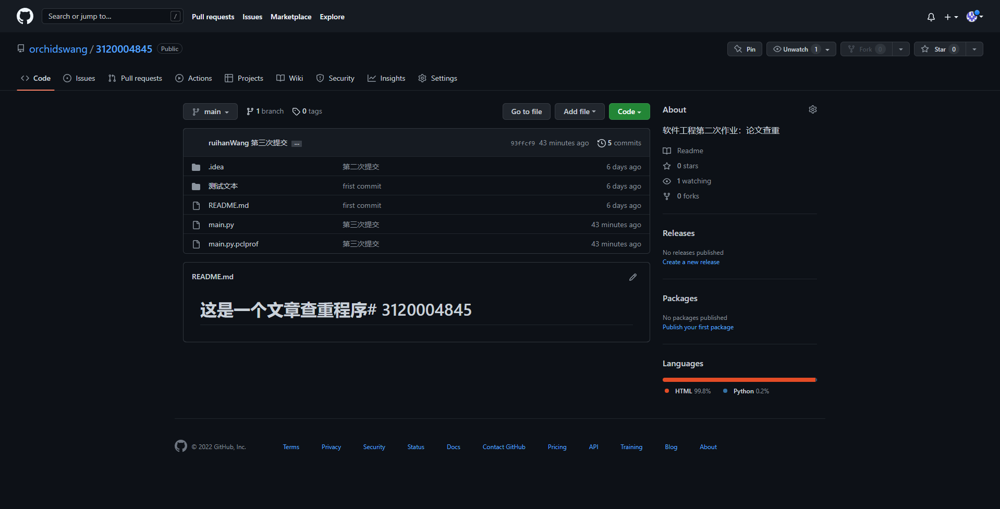
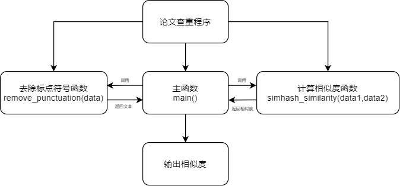
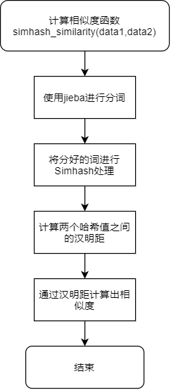
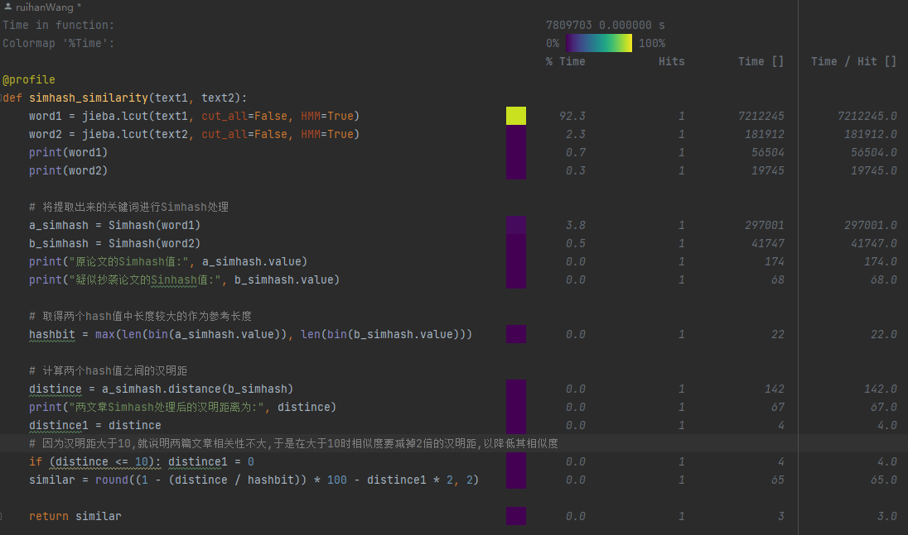
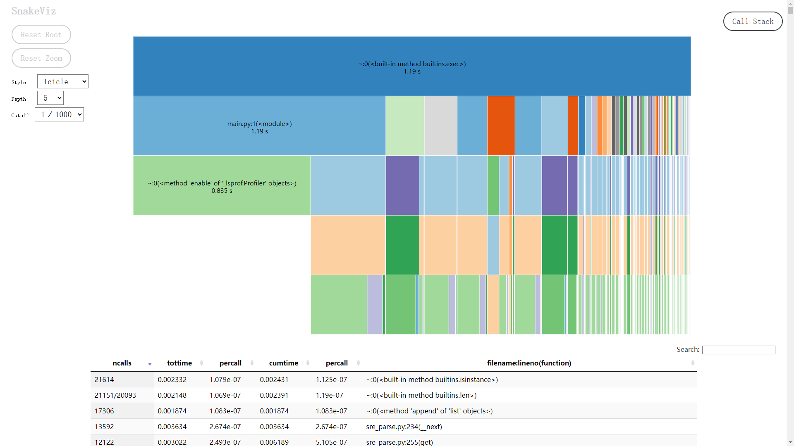

# [软件工程第二次作业]论文查重

[toc]

## 一、基本信息

|           项目           |   内容   |
| :----------------------- | :--- |
| 这个作业属于哪个课程 | [软件工程课程学习](https://bbs.csdn.net/forums/gdut-ryuezh) |
|    这个作业的要求是什么    | [个人项目作业：论文查重](https://bbs.csdn.net/topics/608092799) |
| 这个作业的目标 | 设计一个论文查重算法，给出一个原文文件和一个在这份原文上经过了增删改的抄袭版论文的文件，<br />在答案文件中输出其重复率。 |
| 其他文献参考 | [jieba](jieba.md) <br />[jieba，为中文分词而生的Python库](https://blog.51cto.com/u_15792201/5678064#:~:text=paddle%E6%A8%A1%E5%BC%8F%E4%BD%BF%E7%94%A8%E9%9C%80%E5%85%88%E5%AE%89%E8%A3%85paddlepaddle-tiny%EF%BC%8C%E5%AE%89%E8%A3%85%E5%91%BD%E4%BB%A4%EF%BC%9Apip%20install%20paddlepaddle-tiny%3D%3D1.6.1%E3%80%82%20%E7%9B%AE%E5%89%8Dpaddle%E6%A8%A1%E5%BC%8F%E6%94%AF%E6%8C%81jieba%20v0.40%E5%8F%8A%E4%BB%A5%E4%B8%8A%E7%89%88%E6%9C%AC%E3%80%82,jieba%20v0.40%E4%BB%A5%E4%B8%8B%E7%89%88%E6%9C%AC%EF%BC%8C%E8%AF%B7%E5%8D%87%E7%BA%A7jieba%EF%BC%8Cpip%20install%20jieba%20--upgrade%20%E3%80%82)<br />[Simhash的中文实现](https://www.jianshu.com/p/1187fb7c59c5) |

## 二、项目内容


### 1. Github仓库

* Github[仓库链接](https://github.com/orchidswang/3120004845)

  


### 2.PSP(Personal Software Process)表格

| **PSP2.1**                              | **Personal Software Process Stages**    | **预估耗时（分钟）** |
| --------------------------------------- | --------------------------------------- | -------------------- |
| Planning                                | 计划                                    | 20                   |
| · Estimate                              | · 估计这个任务需要多少时间              | 345                  |
| Development                             | 开发                                    | 40                   |
| · Analysis                              | · 需求分析 (包括学习新技术)             | 60                   |
| · Design Spec                           | · 生成设计文档                          | 30                   |
| · Design Review                         | · 设计复审                              | 10                   |
| · Coding Standard                       | · 代码规范 (为目前的开发制定合适的规范) | 20                   |
| · Design                                | · 具体设计                              | 15                   |
| · Coding                                | · 具体编码                              | 45                   |
| · Code Review                           | · 代码复审                              | 15                   |
| · Test                                  | · 测试（自我测试，修改代码，提交修改）  | 15                   |
| Reporting                               | 报告                                    | 30                   |
| · Test Repor                            | · 测试报告                              | 30                   |
| · Size Measurement                      | · 计算工作量                            | 15                   |
| · Postmortem & Process Improvement Plan | · 事后总结, 并提出过程改进计划          | 15                   |
|                                         | · 合计                                  | 345                  |


### 3.计算模块接口的设计与实现过程

#### (1)函数流程图



#### (2)Simhash简介

* simhash是google于2007年发布的一篇论文《Detecting Near-duplicates for web crawling》中提出的算法，初衷是用于解决亿万级别的网页去重任务，simhash通常用于长文本，通过降维处理，将长文本压缩至几个关键词来代表一篇文章，然后再将这些关键词编码成一个固定长度的二进制字符串（一般为32位或是64位），这样即用一个固定长度的编码来表示一整篇文章，我们想要对比多篇文章，只需要对比这些固定长度的编码就可以了。

* 传统的Hash算法只负责将原始内容尽量均匀随机地映射为一个签名值，原理上仅相当于伪随机数产生算法。传统的hash算法产生的两个签名，如果原始内容在一定概率下是相等的；如果不相等，除了说明原始内容不相等外，不再提供任何信息，因为即使原始内容只相差一个字节，所产生的签名也很可能差别很大。所以传统的Hash是无法在签名的维度上来衡量原内容的相似度，而SimHash本身属于一种局部敏感哈希算法，它产生的hash签名在一定程度上可以表征原内容的相似度。

* **实现流程**
  **1、分词**，把需要判断文本分词形成这个文章的特征单词。最后形成去掉噪音词的单词序列并为每个词加上权重，我们假设权重分为5个级别（1~5）。比如：“ 美国“51区”雇员称内部有9架飞碟，曾看见灰色外星人 ” ==> 分词后为 “ 美国（4） 51区（5） 雇员（3） 称（1） 内部（2） 有（1） 9架（3） 飞碟（5） 曾（1） 看见（3） 灰色（4） 外星人（5）”，括号里是代表单词在整个句子里重要程度，数字越大越重要。

  **2、hash**，通过hash算法把每个词变成hash值，比如“美国”通过hash算法计算为 100101,“51区”通过hash算法计算为 101011。这样我们的字符串就变成了一串串数字，还记得开头说过的吗，要把文章变为数字计算才能提高相似度计算性能，现在是降维过程进行时。

  **3、加权**，通过 2步骤的hash生成结果，需要按照单词的权重形成加权数字串，比如“美国”的hash值为“100101”，通过加权计算为“4 -4 -4 4 -4 4”；“51区”的hash值为“101011”，通过加权计算为 “ 5 -5 5 -5 5 5”。

  **4、合并**，把上面各个单词算出来的序列值累加，变成只有一个序列串。比如 “美国”的 “4 -4 -4 4 -4 4”，“51区”的 “ 5 -5 5 -5 5 5”， 把每一位进行累加， “4+5 -4+-5 -4+5 4+-5 -4+5 4+5” ==》 “9 -9 1 -1 1 9”。这里作为示例只算了两个单词的，真实计算需要把所有单词的序列串累加。

  **5、降维**，把4步算出来的 “9 -9 1 -1 1 9” 变成 0 1 串，形成我们最终的simhash签名。 如果每一位大于0 记为 1，小于0 记为 0。最后算出结果为：“1 0 1 0 1 1”。

  

  <center>Simhash原理图</center>

#### (3)关键函数流程图




​		

### 4.计算模块接口部分的性能改进

* 程序消耗最大的函数:

  

  * 可以看出，在该函数处理时，占用时间最长的是jieba分词

* 性能分析图

  

### 5.计算模块部分单元测试展示

* 测试案例1(内容相似的短句子)

  ```python
  def main():
      data1 = '今天是星期天，天气晴，今天晚上我要去看电影。'
      data2 = '今天是周天，天气晴朗，我晚上要去看电影。'
      similary = simhash_similarity(data1, data2)
  ```

  

  运行结果:

   


* 测试案例2(内容不相似的短句子)

   ```python
   def main():
       data1 = '今天是星期天，天气晴，今天晚上我要去看电影。'
       data2 = '如果星期六不下雨,那么我回去打篮球'
       similary = simhash_similarity(data1, data2)
   ```

  

  运行结果:

   

  

* 测试案例3(内容相似的长篇文章)

   ```python
   def main():
       file1 = '测试文本/orig.txt'
       file2 = '测试文本/orig_0.8_del.txt'
    	similary = simhash_similarity(file1, file2)#实际上在计算相似度之前还有其他处理步骤, 这里这样写是为了便于理解
   ```

  

  运行结果:

   

  

* 测试案例4(内容不相似的长篇文章)

     ```python
   def main():
       file1 = '测试文本/orig.txt'
       file2 = '测试文本/three bodies.txt'
   	similary = simhash_similarity(file1, file2)#实际上在计算相似度之前还有其他处理步骤, 这里这样写是为了便于理解
   ```
  
  
  
  运行结果:
  
   

### 6.计算模块部分异常处理说明

* 当输入的文件路径错误或者不存在时:

    ```python
  def main():
      file1 = '测试文本/ori.txt'
      file2 = '测试文本/ori_0.8_del.txt'
  
      # 判断文件是否存在,如果不存在,则结束运行
      if (os.path.exists(file1) == False | os.path.exists(file2) == False):
          print("文件不存在,请重新输入")
          return 0
  
      f1 = open(file1, encoding='utf-8')
      f2 = open(file2, encoding='utf-8')
          # 将原文文本去除标点符号后导入到程序中去
      data1 = str(remove_punctuation(f1.read()))
      # 将鉴定抄袭文本去除标点符号后导入到程序中去
      data2 = str(remove_punctuation(f2.read()))
  
      similary = simhash_similarity(data1, data2)
  ```
  
  
  
  *目录中并没有这样的两个文件*
  
  
  
  运行结果:
  
   

## 三、课后总结

| **SP2.1**                        | **Personal Software Process Stages** | **预估耗时（分钟）** | **实际耗时（分钟）** |
| --------------------------------------- | ------------------------------------------ | -------------------------- | -------------------------- |
| Planning                                | 计划                                    |                      |                      |
| · Estimate                              | · 估计这个任务需要多少时间              | 345                  | 350                  |
| Development                             | 开发                                    |                      |                      |
| · Analysis                              | · 需求分析 (包括学习新技术)             | 60                   | 90                   |
| · Design Spec                           | · 生成设计文档                          | 30                   | 21                   |
| · Design Review                         | · 设计复审                              | 10                   | 35                   |
| · Coding Standard                       | · 代码规范 (为目前的开发制定合适的规范) | 20                   | 12                   |
| · Design                                | · 具体设计                              | 15                   | 10                   |
| · Coding                                | · 具体编码                              | 45                   | 62                   |
| · Code Review                           | · 代码复审                              | 15                   | 20                   |
| · Test                                  | · 测试（自我测试，修改代码，提交修改）  | 15                   | 35                   |
| Reporting                               | 报告                                    |                      |                      |
| · Test Repor                            | · 测试报告                              | 30                   | 45                   |
| · Size Measurement                      | · 计算工作量                            | 15                   | 10                   |
| · Postmortem & Process Improvement Plan | · 事后总结, 并提出过程改进计划          | 15                   | 10                   |
|                                         | · 合计                                  | 345 | 350 |
